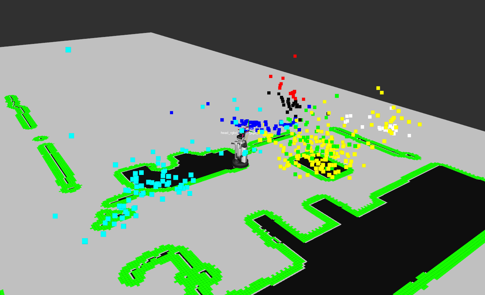
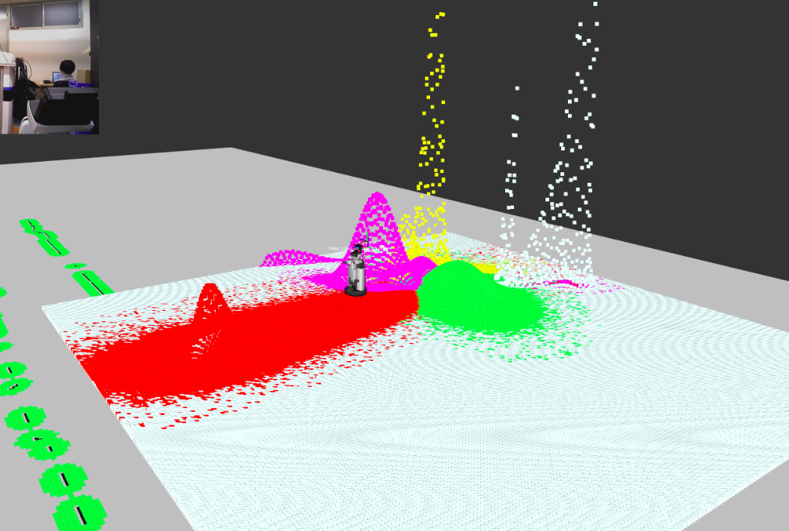
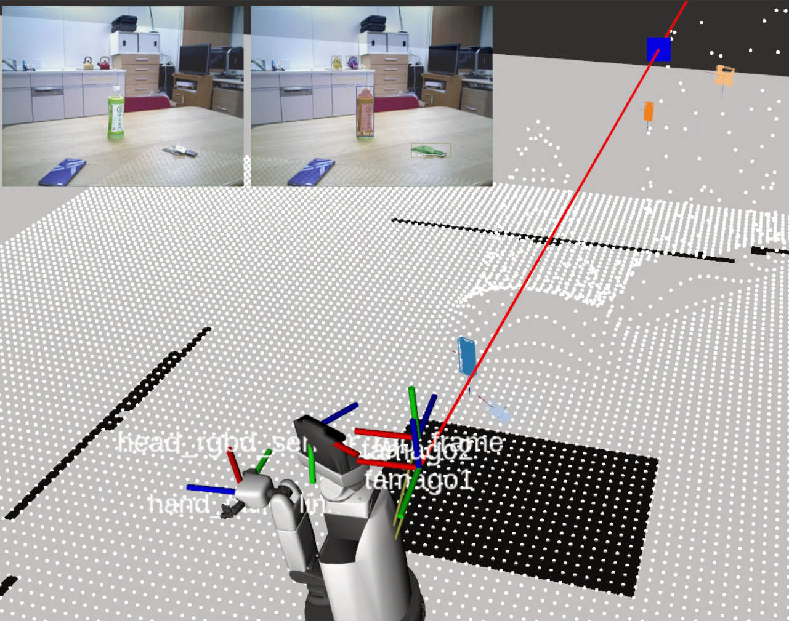

Accumulated Sound Point
=======

This package is about emperical understanding sound points.
You can create probabilistic sound source map.

## Setup

Clone Repositoty
   ```bash
   cd ~/hoge_ws/src
   git clone https://github.com/nakaotatsuya/action_pkg.git
   cd action_pkg
   catkin bt
   source ~/hoge_ws/devel/setup.bash
   ```

## Usage
   If you make a sound, sound direction vector is saved.
   You can set `sound label` arg (-l or --label).
   ```bash
   python save_sound_pos.py
   ```

   After sounds are saved, you can calculate intersections of two sound direction vectors.
   ```bash
   python calculate.py
   ```

   After that, you can create probabilistic sound source map by using EM algorithm.
   You can visualize the plots of the intersections and the map by this.
   ```bash
   python visualized_sound_pos.py
   ```

   | Plots of intersections | Probabilitic sound source map|
   |---|---|
   |||

   And, you can also estimate the sound location by multiplying the probabilistic sound source map and the current sound direction vector by using MUSIC method.
   ```bash
   roslaunch action_pkg visualize_sound_max.launch
   ```
#### Estimated sound position


## Master thesis

This is the content of chapter 3.3.2, 3.3.3, 3.4.2, 3.4.3, 3.6, 4.3 of the master's thesis.